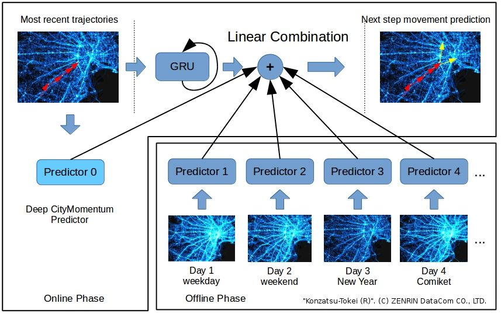

# Zipei Fan's Homepage

Zipei Fan is currently a project assistant professor in Center for Spatial Information Science, the University of Tokyo.

His research interests are:

- Spatiotemporal data mining
- Urban Computing
- Ubiquitous computing
- Data visualization

If you are interested in his research, please feel free to contact him at: fanzipei@iis.u-tokyo.ac.jp or fanzipei@gmail.com

## Projects

1. Decentralized Human Mobility Modeling
   

2. Urban Data Visualization
   

3. Large-scale Human Mobility Prediction
   

4. Irregular Human Mobility Modeling
   

## Publications

- **Zipei Fan**, Xuan Song, Renhe Jiang, Quanjun Chen, Ryosuke Shibasaki. 2019. "Decentralized Attention-based Personalized Human Mobility Prediction". Proc. ACM Interact. Mob. Wearable Ubiquitous Technol. 3, 4, Article 133 (December 2019)

- **Zipei Fan**, Xuan Song, Quanjun Chen, Renhe Jiang, Kota Tsubouchi, Ryosuke Shibasaki. 2019. "Deep Multiple Instance Learning for Human Trajectory Identification". In Proceedings of the 27th ACM SIGSPATIAL International Conference on Advances in Geographic Information Systems (SIGSPATIAL '19)

- **Z. Fan**, X. Song, T. Xia, R. Jiang, Q. Chen, R. Shibasaki and H. Kaneda, “Online Deep Ensemble Learning for Predicting Citywide Human Mobility”, Proc. of the ACM on Interactive, Mobile, Wearable and Ubiquitous Technologies (IMWUT) (UbiComp 2018).

- **Zipei Fan**, Xuan Song, Ryosuke Shibasaki, Tao Li, Hodaka Kaneda, “CityCoupling: bridging intercity human mobility”, Proceedings of the 2016 ACM International Joint Conference on Pervasive and Ubiquitous Computing, 2016

- **Zipei Fan**, Ayumi Arai, Xuan Song, Apichon Witayangkurn, Hiroshi Kanasugi, Ryosuke Shibasaki, “A Collaborative Filtering Approach to Citywide Human Mobility Completion from Sparse Call Records”, Proc. of the 25th International Joint Conference on Artificial Intelligence (IJCAI), 2016.

- **Zipei Fan**, Xuan Song, Ryosuke Shibasaki, Ryutaro Adachi, “CityMomentum: An Online Approach for Crowd Behavior Prediction at a Citywide Level”, Proc. of ACM International Joint Conference on Pervasive and Ubiquitous Computing (UbiComp), 2015. **(Honorable Mention Awards)**

- **Zipei Fan**, Xuan Song, Ryosuke Shibasaki, “CitySpectrum: A Non-negative Tensor Factorization Approach”, Proc. of ACM International Joint Conference on Pervasive and Ubiquitous Computing (UbiComp), pp. 5-14, 2014.

- Xiaodan Shi, Xiaowei Shao, **Zipei Fan**, Renhe Jiang, Haoran Zhang, Zhiling Guo, Guangming Wu, Wei Yuan, Ryosuke Shibasaki, "Multimodal Interaction-Aware Trajectory Prediction in Crowded Space", Proc. of Thirty-Second AAAI Conference on Artificial Intelligence (AAAI), 2020.

- Q. Chen, X. Song, **Z. Fan**, T. Xia, H. Yamada and R. Shibasaki, "A Context-Aware Nonnegative Matrix Factorization Framework for Traffic Accident Risk Estimation via Heterogeneous Data," 2018 IEEE Conference on Multimedia Information Processing and Retrieval (MIPR), Miami, FL, 2018, pp. 346-351

- Dou Huang, Xuan Song, **Zipei Fan**, Renhe Jiang, Ryosuke Shibasaki, Yu Zhang, Haizhong Wang, Yugo Kato, "A Variational Autoencoder Based Generative Model of Urban Human Mobility," 2019 IEEE Conference on Multimedia Information Processing and Retrieval (MIPR), San Jose, CA, USA, 2019, pp. 425-430

- H. Zhang, X. Song, T. Xia, M. Yuan, **Z. Fan**, R. Shibasaki, Y. Liang, “Battery electric vehicles in Japan: Human mobile behavior based adoption potential analysis and policy target response”, Applied Energy, 2018.

- R. Jiang, X. Song, **Z. Fan**, T. Xia, Q. Chen, Q. Chen, and R. Shibasaki, “Deep ROI-Based Modeling for Urban Human Mobility Prediction”, Proc. of the ACM on Interactive, Mobile, Wearable and Ubiquitous Technologies (IMWUT) (UbiComp 2018), 2018.

- R. Jiang, X. Song, **Z. Fan**, T. Xia, Q. Chen, S. Miyazawa, R. Shibasaki, “DeepUrbanMomentum: An Online Deep-Learning System for Short-Term Urban Mobility Prediction”, Proc. of Thirty-Second AAAI Conference on Artificial Intelligence (AAAI), 2018.

- T. Xia, X. Song, D. Huang, S. Miyazawa, **Z. Fan**, R. Jiang, R. Shibasaki, “Outbound Behavior Analysis Through Social Network Data: a case study of Chinese people in Japan”, Proc. of Big Social Media Data Management and Analysis, IEEE BigData 2017.

- Ayumi Arai, **Zipei Fan**, Dunstan Matekenya, Ryosuke Shibasaki, “Comparative perspective of human behavior patterns to uncover ownership bias among mobile phone users”, ISPRS International Journal of Geo-Information

- **Zipei Fan**, Zeliang Wang, Jinshi Cui, Franck Davoine, Huijing Zhao, Hongbin Zha: "Monocular Pedestrian Tracking from a Moving Vehicle". ACCV Workshops (2) 2012: 335-346
